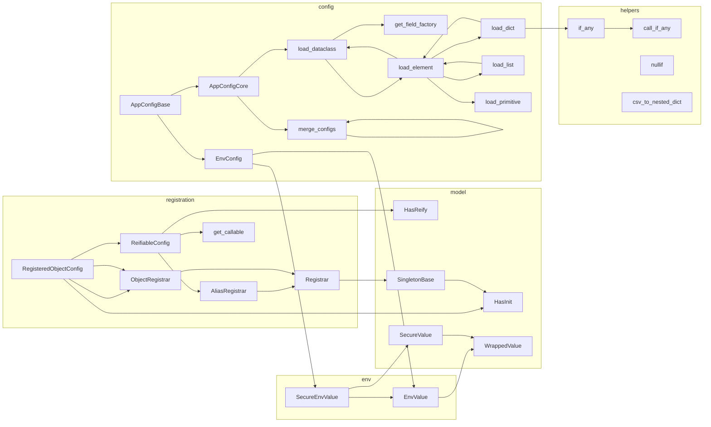

```mermaid
graph LR
    subgraph model
        HasInit
        HasReify
        SingletonBase
        SecureValue
        WrappedValue
    end

    subgraph helpers
		if_any
		call_if_any
		nullif
		csv_to_nested_dict
		
	end
	
	subgraph registration
	    AliasRegistrar
		ObjectRegistrar
		Registrar
		RegisteredObjectConfig
		get_callable
		ReifiableConfig
	end
	
	subgraph config
	    AppConfigBase
	    AppConfigCore
		EnvConfig
		get_field_factory
		load_dataclass
		load_dict
		load_element
		load_list
		load_primitive
		merge_configs
	end

	subgraph env
		EnvValue
		SecureEnvValue
	end
	
    %% Class hierarchy
    AliasRegistrar --> Registrar
    AppConfigBase --> AppConfigCore
    AppConfigBase --> EnvConfig
    EnvValue --> WrappedValue
    ObjectRegistrar --> Registrar
    RegisteredObjectConfig --> HasInit
    RegisteredObjectConfig --> ReifiableConfig
    Registrar --> SingletonBase
    ReifiableConfig --> HasReify
    SecureEnvValue --> EnvValue
    SecureEnvValue --> SecureValue
    SecureValue --> WrappedValue
    SingletonBase --> HasInit

    %% Call dependency
    AppConfigCore --> merge_configs
    AppConfigCore --> load_dataclass
    EnvConfig --> EnvValue
    EnvConfig --> SecureEnvValue
    if_any --> call_if_any
    load_dataclass --> load_element
    load_dataclass --> get_field_factory
    load_dict --> load_element
    load_dict --> if_any
    load_element --> load_dataclass
    load_element --> load_dict
    load_element --> load_list
    load_element --> load_primitive
    load_list --> load_element
    merge_configs --> merge_configs
    RegisteredObjectConfig --> ObjectRegistrar
    ReifiableConfig --> get_callable
    ReifiableConfig --> AliasRegistrar
    RegisteredObjectConfig --> ObjectRegistrar
```